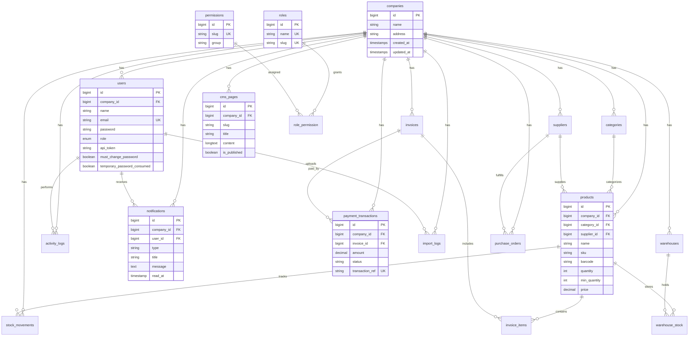

# Database ERD

AIMS uses a multi-tenant relational schema with 26 tables (3NF normalized).

## Table inventory (26)

| Table | Purpose |
|-------|---------|
| users | Authentication and role assignment |
| password_reset_tokens | Password recovery |
| sessions | Session storage |
| cache / cache_locks | Application cache |
| jobs / job_batches / failed_jobs | Queue processing |
| companies | Multi-tenant root entity |
| categories | Product categorization |
| suppliers | Vendor management |
| products | Inventory items |
| stock_movements | Stock in/out audit trail |
| invoices | Customer billing |
| invoice_items | Line items per invoice |
| activity_logs | User action audit |
| roles | RBAC roles |
| permissions | Granular access rights |
| role_permission | Role-to-permission mapping |
| notifications | Real-time alert storage |
| payment_transactions | Online payment records |
| cms_pages | Content management |
| import_logs | CSV import audit |
| warehouses | Storage locations |
| warehouse_stock | Per-warehouse quantities |
| purchase_orders | Procurement tracking |
