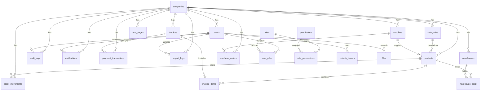

# Database ERD

AIMS uses a multi-tenant MySQL schema with 26+ tables in 3NF.

## Mandatory system tables

| Table | Purpose |
|-------|---------|
| users | Accounts with roles and company scope |
| roles | admin, manager, staff |
| user_roles | Many-to-many user and role link |
| permissions | Fine-grained access slugs |
| role_permissions | Role to permission mapping |
| refresh_tokens | JWT refresh token storage |
| audit_logs | Critical action audit trail |
| notifications | In-app alerts |
| settings | Global key/value config |
| files | Uploaded file metadata |

## Domain tables

| Table | Purpose |
|-------|---------|
| companies | Tenant root |
| categories | Product groups |
| suppliers | Vendors |
| products | Inventory items |
| stock_movements | Stock in/out history |
| invoices / invoice_items | Billing |
| payment_transactions | Payment records |
| cms_pages | Landing page content blocks |
| import_logs | Import job history |
| warehouses / warehouse_stock | Storage locations |
| purchase_orders | Supplier orders |

## Supporting tables

cache, cache_locks, jobs, job_batches, failed_jobs, sessions, password_reset_tokens
